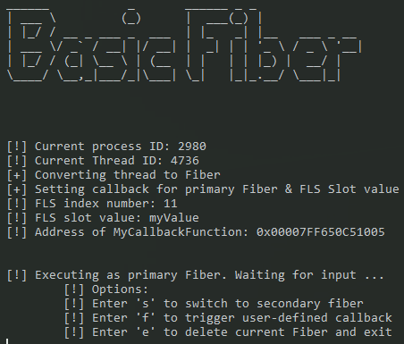
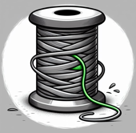
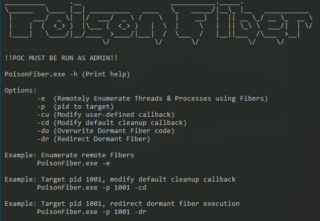
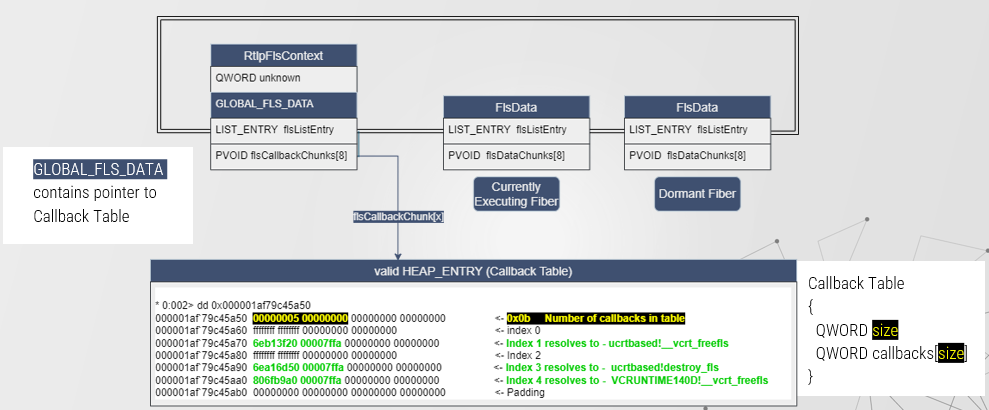
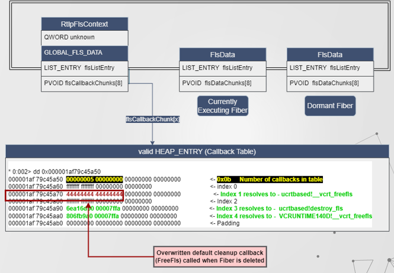
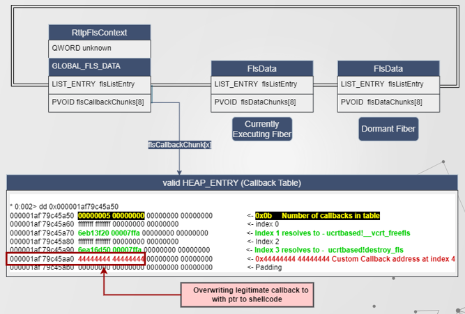
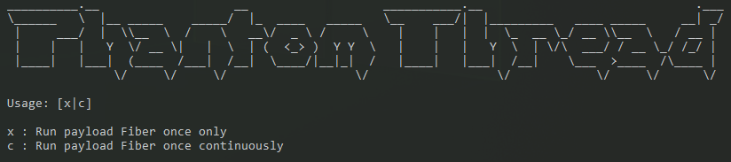
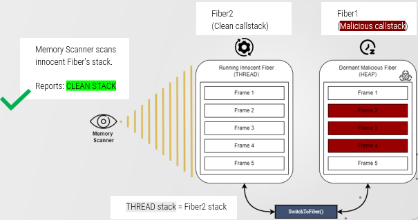
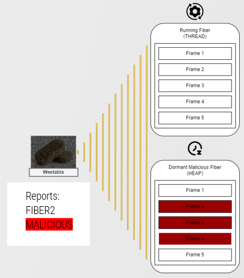
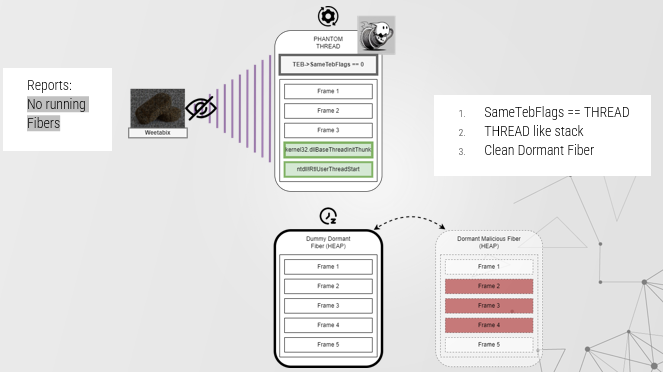

#### Disclaimer
**NOTE**: *These are POC techniques, they aren't intended to be used in real-life red-teaming scenarios. 
Both POCs demonstrate the new techniques, but no attempt has been made to make the rest of POCs evasive. 
For instance, both examples use basic memory allocation techniques & store shellcode within RWX memory regions / .rsrc section.
Also, PoisonFiber uses CreateToolhelp32Snapshot & standard Windows APIs to enumerate threads using Fibers. As such expect to generate telemetry for:*
- *ETW TI ID:14 (KERNEL_THREATINT_KEYWORD_WRITEVM_REMOTE).*
- *Periodic memory scanning for RWX regions.*
- *Usermode hooks that could be placed on the Fiber API by EDR/AV vendors to collect usage.*

*Prior to using these techniques in an operational environment, I would recommend fluctuating the memory access & page protections. In addition to using a more low-key method of thread enumeration*

# Immoral Fiber 

This repository contains two new offensive techniques using Windows Fibers:
  - PoisonFiber (A remote enumeration & Fiber injection capability POC tool)
  - PhantomThread (An evolved callstack-masking implementation)

It also contains an example test program that makes use of Windows Fibers which can be used to inject into with PoisonFiber:
  - BasicFiber

## BasicFiber
Basic Fiber is a very simple test program that serves as a target for PoisonFiber.
BasicFiber consists of: 
1. Two Fibers that switch between one another.
2. A user defined Fiber Local Storage (FLS) callback function that can be triggered manually.

  

It waits for user input to either:
  - `'s' + Enter` - Switch execution from the currently executing Fiber to the dormant Fiber.
  - `'f' + Enter` - Execute the user-defined callback.
  - `'e' + Enter` - Delete the current Fiber which will call `ExitThread()` internally.

## PoisonFiber 
  
PoisonFiber is the first tool of its kind to make remote Fiber injection available on Windows.
It demonstrates two types of remote Fiber injection by either injecting into a remote Dormant Fiber object or by manipulating remote FLS callbacks. 

The four sub-techniques it offers are:
  - Remote Dormant Fiber injection via overwriting existing Fiber code.
  - Remote Dormant Fiber injection via redirecting execution flow. 
  - Remote callback injection via overwriting default Fiber local storage cleanup callback.
  - Remote callback injection via manipulating user-defined callbacks with malicious callback.

There are two different pieces of shellcode inside the PoisonFiber POC
1. Custom shellcode that returns normally. This is stored and loaded from the resources section of the binary
2. A smaller piece of shellcode that pops calc.exe and exits via SEH. This has been generated using msfvenom.

Only Dormant Fiber Injection via overwriting uses the second piece of shellcode since there is no point in returning to the original Fiber code as it has been overwritten and will crash if we attempt to do so.
The remaining techniques use the first piece as it allows normal program flow to continue after it has been executed.

### Remote Dormant Fiber Injection

>NOTE: Both sub-techniques rely on the switching of Fibers to trigger shellcode execution so remember to switch execution between fibers in victim process (e.g. BasicFiber.exe) when testing.

Fibers exist within the context of a Usermode Thread object & heap memory. Dormant Fibers are Fiber objects that are currently not switched to and thus not executing). If we can locate remote dormant Fiber objects, we can write shellcode at the address of which they will continue, thereby whenever the remote application naturally schedules the dormant Fiber (switches to it) this will trigger the execution of our injected code.

But before injecting any shellcode PoisonFiber must first remotely enumerate all of the Dormant Fiber objects from memory. It does this using the following steps:
1. Enumerate all running Threads on a host, checking the `TEB->SameTebFlags` to identify if the `HasFiberData` mask has been set.
2. Remotely enumerate the heaps of all processes which have Threads that make use of Fibers.
3. Calculate & collect individual heap blocks of a requested 0x530 bytes (our potential Dormant Fiber objects).
4. Validate the potential dormant Fiber objects by generating expected FiberData field values based on a unique `XoredCookie` value inside each Fiber object.

Once completed PoisonFiber has valid list of dormant Fiber objects to choose from. As shown in the diagram below:

Within a dormant Fiber object, we can find it's `CONTEXT` structure (the saved execution state). The `CONTEXT’s` `RIP` will point to a `RET` which will essentially `POP` whatever is on top of the Fiber's stack and jump to it (when it is switched to from the currently running Fiber). Thus, the value at the top of a dormant Fiber's stack will contain the address at which to continue execution. This is illustrated below:

#### Dormant Fiber injection via overwriting existing Fiber code.

Example command:  `PoisonFiber.exe -p 1234 -do`

The first sub-technique records the resumption address by reading the first value on top of the dormant Fiber's stack. It then adds writable memory permissions & injects our malicious shellcode here providing enough space is available. Whenever the dormant Fiber is switched to naturally by the process the shellcode will be executed on our behalf instead of the legitimate Fiber code. 

*NOTE: As previously mentioned directly adding RWX memory permissions is rather crude, in real world scenarios you would change this to avoid detection, but here it doesn't matter since it the POC is just a demonstration. In addition, overwriting the legitimate Fiber code directly without restoring it afterwards will likely crash the injected process after the shellcode has finished executing.*

#### Dormant Fiber injection via redirecting execution flow. 

Example command `PoisonFiber.exe -p 1234 -dr`

For this sub-technique instead of overwriting the Fiber code, we allocate a new region of memory for our shellcode and push this address onto the dormant Fiber's stack. That way when a Fiber is switched to it will execute our new region of memory first (illustrated below).

In addition, we aren’t corrupting the program memory, so providing our shellcode returns normally it will maintain the original execution of the remote process (without crashing) after executing our malicious code.

#### Dormant Fiber Injection Advantages / Disadvantages
Advantages:
- Can target processes using Fibers and inject into them. 
- No need for to trigger execution ourselves, this is handled be the inherent Fiber switching of the remote process.
- Not creating any new remote threads & avoiding sensitive APIs.
- Overwriting existing Fiber object code requires no new memory regions to be created.

Disadvantages:
- The Thread enumeration component is potentially noisy to AVs.
- Race conditions possible between injection & application switching fibers.
- Execution subject to remote application Fiber switching.
- Overwriting will likely crash a process unless FiberData is restored after shellcode has finished executing.
- Redirection still requires memory allocation for shellcode.

### Remote Callback Injection

Fiber local storage (FLS) is the fiber equivalent to Thread Local Storage (TLS). It allows fibers to store and retrieve values via an index. When allocating a new FLS index a callback function can also be defined. Callback functions are executed whenever the specific FLS index associated with it is freed or when the Fiber using that FLS is deleted. Pointers to callbacks are stored in a callback table.

PoisonFiber first remotely enumerates the Fiber callback table from memory by:
1. Collecting the `FlsData` field inside a remote Fiber object (First diagram below)
2. Enumerating through a linked list of `FlsData` structs to find the `GLOBAL_FLS_DATA` ptr (second diagram)
3. Identifies the remote callback table location from a field inside `GLOBAL_FLS_DATA` (second diagram)

  

#### Callback injection via overwriting default Fiber local storage cleanup callback

Example command `PoisonFiber.exe -p 1234 -cd`

Once it has access the remote process Fiber callback table PoisonFiber can overwrite a default callback with a ptr to our shellcode. This will be triggered whenever the Fiber with FLS is deleted or the owning thread running Fibers exists. 

#### Callback injection via manipulating user-defined callbacks

Example command `PoisonFiber.exe -p 1234 -cu`

Alternatively, PoisonFiber can overwrite a user-defined FLS callback with a ptr to shellcode. The advantage of this method being it our shellcode will be cleaned up from memory for us & it may increase the likelihood of the shellcode being executed prior to the Fiber being deleted or the thread exiting, as the application may free the FLS index by its own accord. The downside of this technique is that it may introduce instability or undefined behaviour in the remote process after the shellcode has finished executing.

#### Callback Injection Advantages / Disadvantages
Advantages:
- Injected callback cleaned up automatically by Thread after execution.

Disadvantages:
- Fiber Local Storage needs to already be in place.
- One-time execution only (possible advantage).
- Careful targeting when overwriting user-defined callbacks to not introduce crashes.

#### PoisonFiber prerequisites

- Victim process must be using Fibers already.  
- Victim process must be using Fiber Local Storage if injecting via callbacks.  
- PoisonFiber must have sufficient privileges to inject into remote process.  

## PhantomThread

PhantomThread is an evolved implementation of Callstack Masking that looks to address some of the weaknesses from the original technique. It does this by removing the ability of memory scanners to target Fibers specifically. It also temporarily overwrites the masked stack with a clean legitimate stack when not in use. It is essentially boilerplate code that can be adapted should an attacker wish to implement a more robust method of callstack masking themselves.

**NOTE**: *When executing shellcode within a Fiber it still has to temporarily unmask itself in order to execute code. Thus masking doesn't protect against in-line callstack collection (only periodic & targeted scanning methods). Thus, if an attacker knows their shellcode will likely trigger an in-line callstack collection by an EDR e.g. Remote memory reads to lsass memory. Then they are better served using an active callstack spoofing mechanism such as [VulcanRaven](https://github.com/WithSecureLabs/CallStackSpoofer)*.

#### Traditional Callstack masking & weaknesses

Callstack masking hides the callstack of a beacon / payload whenever it is sleeping. It does this by switching to a secondary (clean looking) dormant Fiber when inactive. That way whenever a periodic memory scanner walks the Threads current stack it will be presented with the clean stack of the dormant Fiber instead of a malicious looking stack. This was implemented CobaltStrike's Artefact kit in 2022 & subsequently appeared in open-source implementations too. I have illustrated the basic principle below:

Unfortunately, this technique isn't foolproof. In fact, very basic detection strategies have already been highlighted on how to discover this. Such as looking for `RtlUserFiberStart()` routines at the beginning of callstacks and combining it with other suspicious indicators to uncover CS beacons. Please see the following MDSec blog post more info:  
https://www.mdsec.co.uk/2022/07/part-2-how-i-met-your-beacon-cobalt-strike/

In addition, tools such as [**Weetabix**](https://github.com/JanielDary/weetabix) can recover dormant Fiber object from memory. Which could then be used to rebuild the hidden malicious stack thus uncovering the mask:

#### PhantomThread overview

PhantomThread removes the following indicators when the payload is sleeping thus limiting the ability of memory scanners to target Threads using Fibers:
1. The `HasFiberData` mask inside the `TEB->SameTebFlags` field which indicates to the OS if a Thread is running as a Fiber.
2. The start routine `RtlUserFiberStart()` which appears within callstack of Fibers created using `CreateFiber()` API call. As mentioned above.

In addition, PhantomThread also masks the dormant Fiber (containing the malicious callstack) as well as the currently executing Fiber while the payload is sleeping. This is to prevent detection by tools that are able to enumerate not just the running Fiber's callstack but also dormant Fiber's callstacks found in Fiber Objects on the heap. It does this by temporarily patching the malicious Fiber with a legitimate dummy Fiber that has had its XoredCookie modified so it passes a sanity check inside `SwitchToFiber()` and can replace the malicious Fiber permanently if the attacker so desires.

Basic principle:  

#### Execution Flow

 Example `.\PhantomThread.exe c`

###### Step 1. Setup & Removal of Fiber indicators

**Fiber1** - *Clean Fiber*: 
- Fiber1 is the initial Fiber created from the running Thread via `ConvertThreadToFiber()`. This maintains a callstack of the original Thread and does **NOT** contain any Fiber based start routines.
- Patches the `TEB->SameTebFlags` field with a value to that of a Thread.
- It creates a Dummy Fiber with a clean callstack.
- Generates a valid `FiberObject.XoredCooke` value for the Dummy Fiber so it can run without causing an error.
- Then switches execution to Fiber2. 

###### Step 2. Shellcode execution
**Fiber2** -*Malicious Fiber*:
- This executes from a DLL, which loads a resource within the DLL, inside the resource is some (harmless) shellcode. This is there to imitate malicious code of an attacker. 
- When Fiber2 has finished executing shellcode it waits for 10 seconds and then switches execution back to Fiber1.

###### Step 3. Masking Dormant Fiber with Dummy Fiber
**Fiber1** - *Clean Fiber*:
- When Fiber2 is not executing e.g. Imitating when beacon/payload goes into a sleep state. Then Fiber1 patches the Dummy Fiber in place of Fiber2. 
- When the sleep has finished it patches back Fiber2 in place of the Dummy Fiber so execution can resume from Step2. 
- The whole point of using a Dummy Fiber patched in place of Fiber2 is to mask it from memory scanners that look to reveal dormant Fiber stacks in addition to currently executing Fibers running in the context of a Thread.

***NOTE**: Phantom Thread also allows the option to trigger our malicious fiber once `.\PhantomThread.exe x` and replace it with our dummy Fiber permanently.*  

#### Advantages / Disadvantages 

Advantages: 
- No Fiber Artefacts - Looks identical to a THREAD. Harder to target.
- Valid Callstacks - Avoids using faked Callstacks.
- Dormant Fiber masked in addition to running Fiber.
- No sacrificial Threads/Fibers required.

Disadvantages:
- Does not mask against inline callstack collection.

### NOTES
 
- Tested on Windows 10 build 19044
- IDB files with my reversed Fibers API funcs & undocumented structs applied.
